# 广工枢纽
广工枢纽（GDUT Hub）是广东工业大学校园智能信息聚合平台，支持师生获取通知公告、水电服务、后勤报修、教务信息等校内内容，实现校园信息的聚合与智能化服务。

## 1. 登录页面
### 功能流程
1. 用户在对应输入框填写学号 / 工号、密码
2. 点击 “Sign In” 按钮提交身份验证请求
3. 验证通过后跳转至系统首页

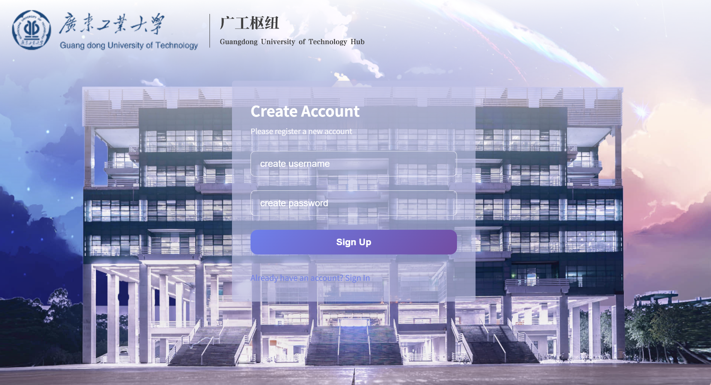

 

#### 1.1  输入密码登录
1. 用户填写用户名、密码至对应输入框
2. 点击 “Sign Up” 按钮提交注册请求
3. 注册完成后跳转至登录界面

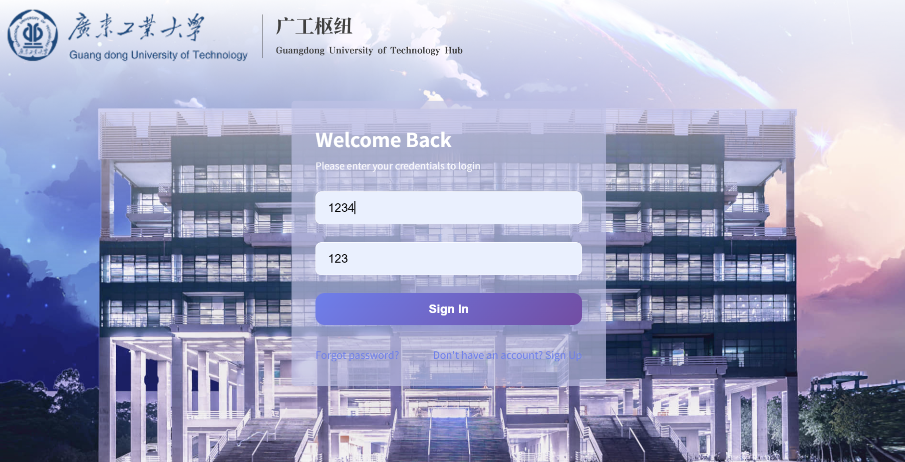

 

#### 1.2  忘记密码
1. 登录界面点击 “Forget password?” 触发弹窗
2. 查看弹窗内的密码找回说明
3. 点击关闭按钮（×）返回注册界面

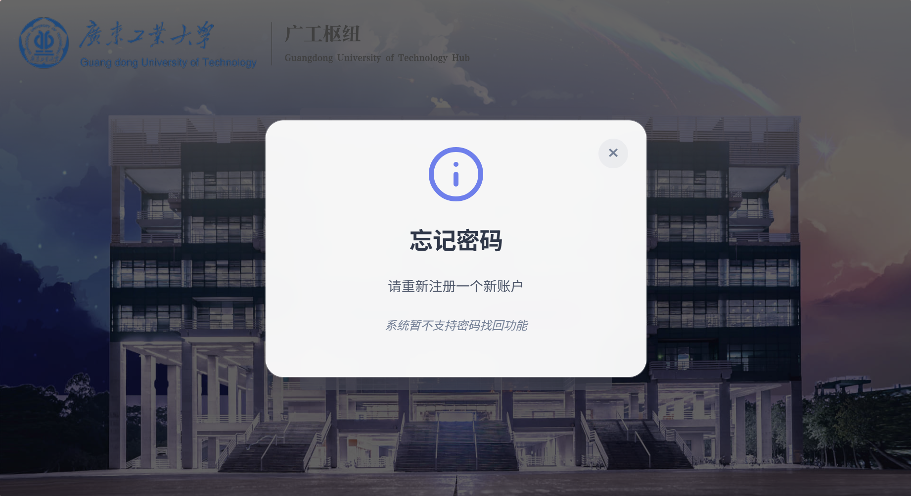

 

## 2.  登录成功进入首页
1. 可通过侧边栏 / 快捷入口访问对应校园服务功能
2. 在查询输入框提交内容（如假期安排）以获取对应信息

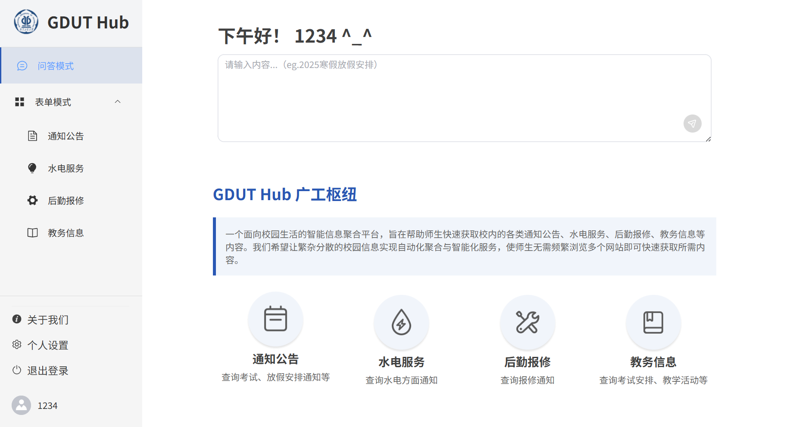

 

### 2.1 自然语言问答
用户输入问题，系统结合知识库与大模型生成回答

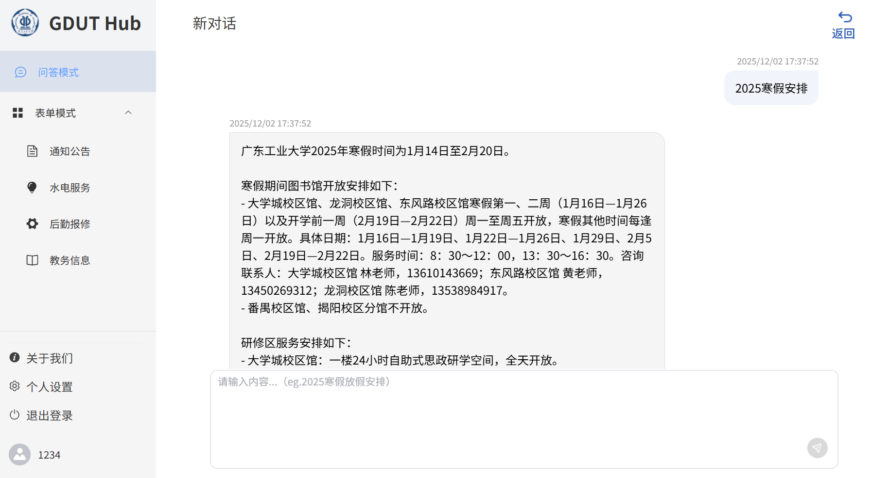

 

### 2.2 信息栏目
1. 跳转到相关关键词条目，如校园通知、水电服务、教务公告、后勤通知等
2. 按类型分类：校园通知、水电服务、教务公告、后勤通知等。
3. 详情查看：点击通知标题查看完整内容。
4. 关键词搜索：可按关键词、时间区间筛选通知。
5. 通知更新：结合爬虫实时更新水电服务公告。
6. 考试安排：提供各类考试、比赛时间、地点及报名信息。
7. 公告与提醒：教务通知、选课提醒等集中显示。

#### 2.2.1 通知公告
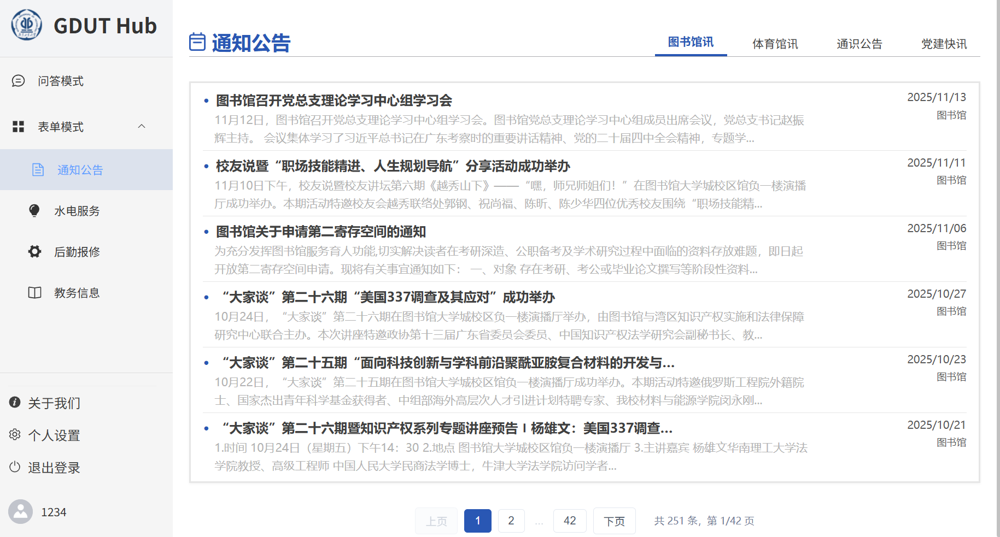
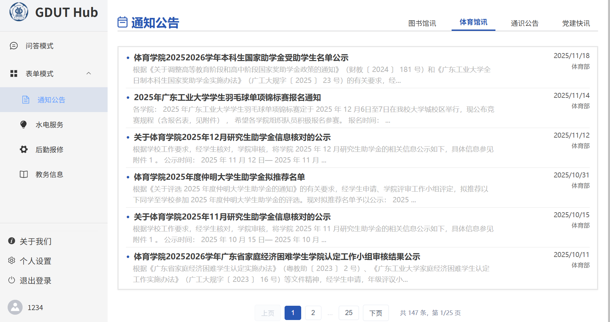
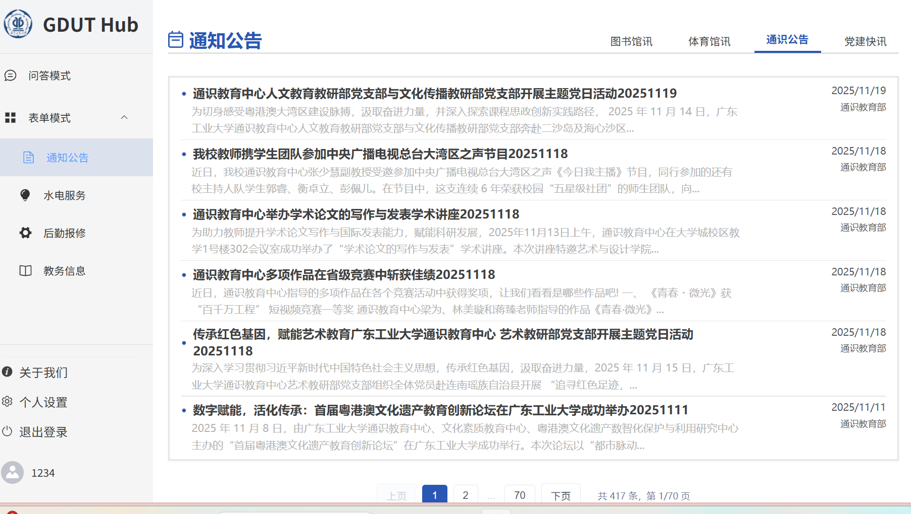

#### 2.2.2 水电服务
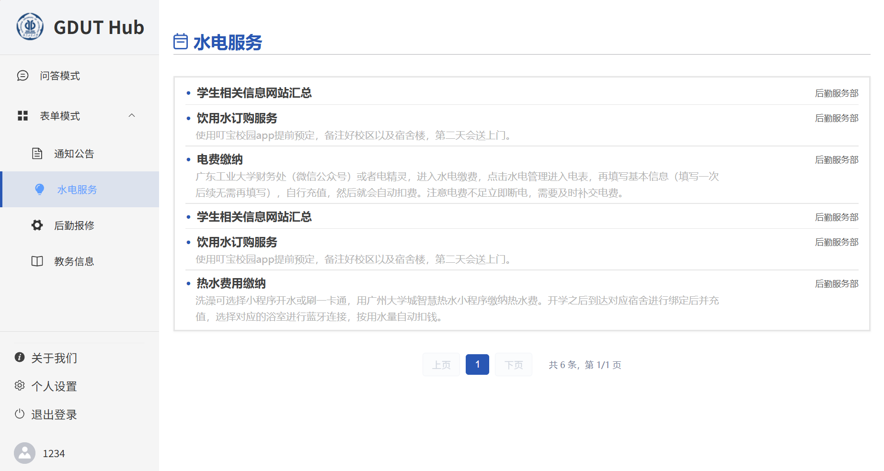

#### 2.2.3 后勤服务

#### 2.2.4 教务信息
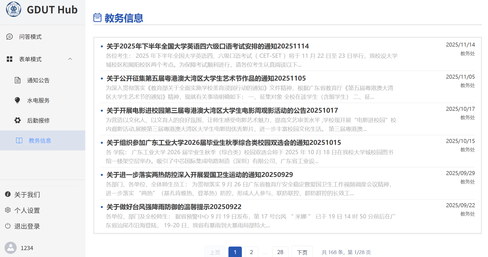

## 3. 关于我们
关于我们团队详细介绍

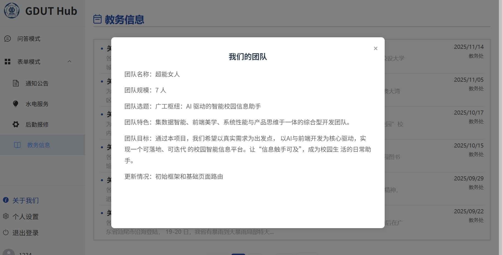

## 4. 个人设置
对账号进行密码修改

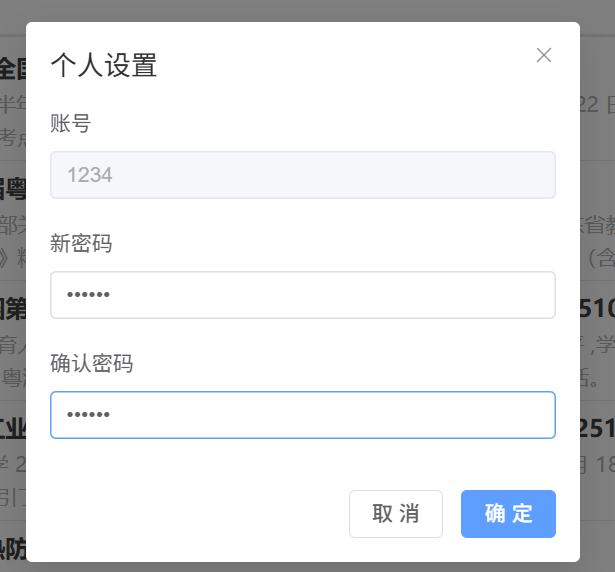

## 5.  退出登录
完成操作后退出登录

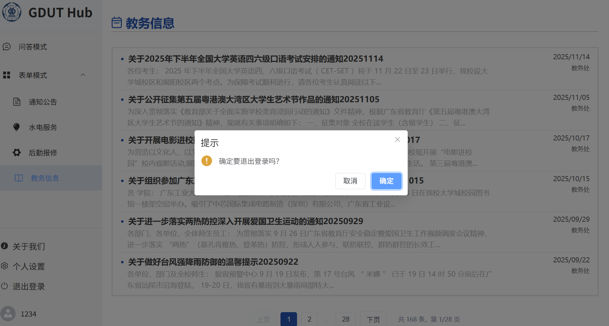